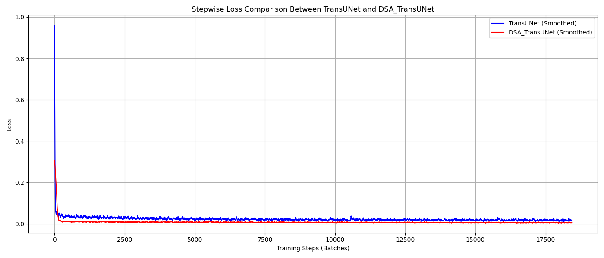
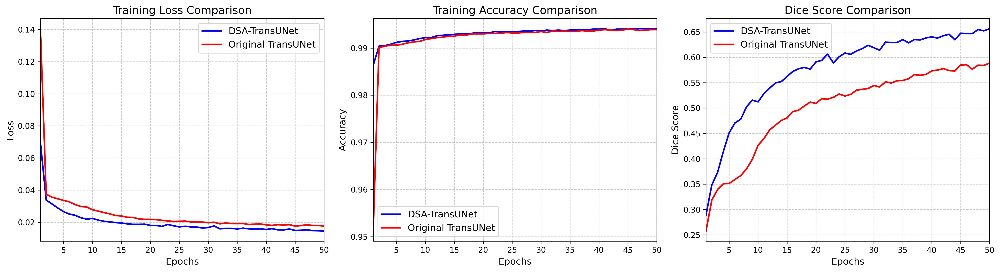

# TransUNet-DSA-Segmentation
# TransUNet with Directional/Spatial Attention (DSA) for Medical Image Segmentation


This repository implements **TransUNet integrated with Directional/Spatial Attention (DSA)** for high-precision medical image segmentation. By combining the global context modeling of Transformers with localized spatial attention mechanisms, this model improves boundary delineation and segmentation performance over standard U-Net and baseline TransUNet architectures.

---

## 📌 Project Overview

* **Domain:** Computer Vision / Medical Image Analysis
* **Task:** 3D Brain Tumor Segmentation
* **Dataset:** BraTS2020
* **Baseline:** TransUNet
* **Proposed Method:** TransUNet + Directional/Spatial Attention (DSA)
* **Framework:** PyTorch
* **Programming Language:** Python
* **Hardware Acceleration:** CUDA / GPU

---

## 🧠 Methodology

The proposed approach extends the **TransUNet** architecture by integrating a **Directional/Spatial Attention (DSA)** mechanism into the segmentation pipeline.

### Architecture

```text
3D MRI Volume
      ↓
Preprocessing
      ↓
TransUNet Encoder
      ↓
Transformer-based Feature Extraction
      ↓
Directional/Spatial Attention (DSA)
      ↓
Decoder
      ↓
3D Tumor Segmentation

---


## 📊 Experimental Results & Loss Comparison

The incorporation of the DSA mechanism accelerates convergence and lowers training/validation loss across training steps compared to standard TransUNet.

### Stepwise Loss Comparison


### Model Comparison & Evaluation


---
